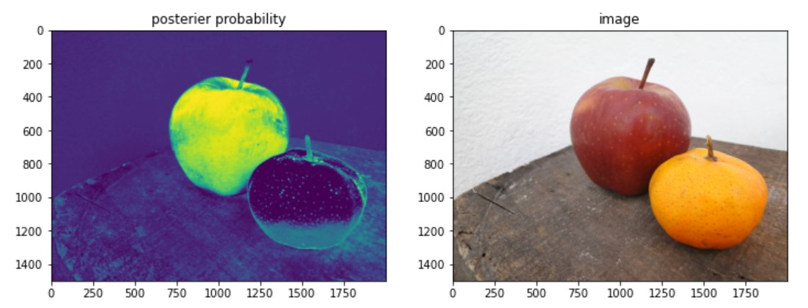

# Mixture of Gaussian model to distinguish apple and non-apple pixels

Genrating posterior probability masks to differentiate apple and non-apple pixels given an image using Mixture of Gaussian model. 

The maximum a posteriori (MAP) estimates of the model parameters are found using the Expectation Maximsation algorithm. The model performace was evaluated by plotting the ROC curve.
The code and further description can be found in the notebook [here](https://github.com/SulakshanaChakraborty/MixtureOfGaussian/blob/main/practicalMixGauss_Apples.ipynb).

